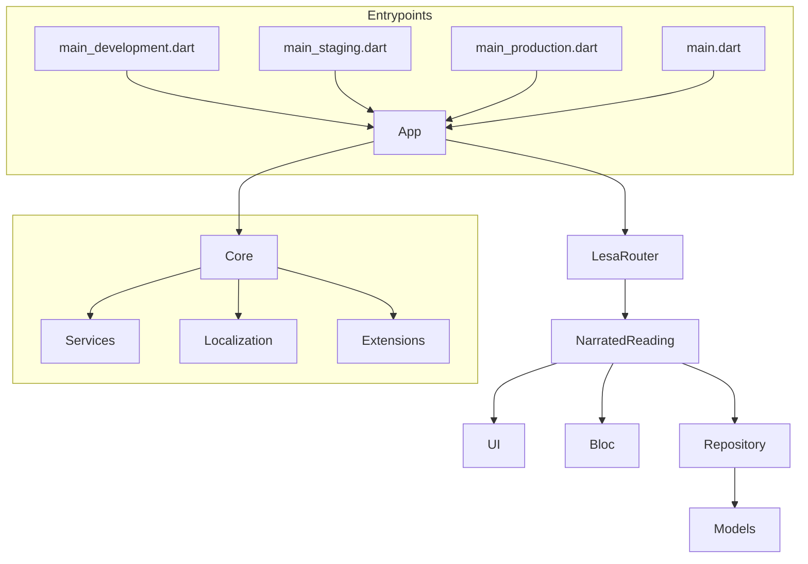
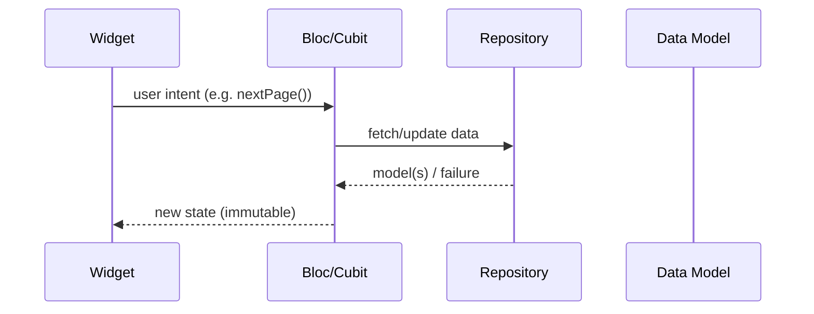

# 📚 Lesa – Architecture & Design Decisions

> **Context** – This is my decisions and rough guide to _Lesa Flutter Dev Test_ app. It explains **why** the codebase looks the way it does, the architectural choices I made, and how it works as a whole. First of all, probably most important decision I made was to use my template when creating the project (only partly for what I needed, or felt would be beneficial for the project), since I noticed I needed to recreate some of the elements to write good and well structured code.

---

## 1 High‑level overview



- **Feature‑based MVVM/MV*O*** – In the project I used one of the architectures provided by the official [Flutter app architecture docs](https://docs.flutter.dev/app-architecture) but with little tweaks. Each _feature_ owns its UI widgets, blocs, repositories and models.
- **Template baseline** – I bootstrap new projects with a personal template that already provides environment handling, theming, localization, DI and helpful helpers (check `core/`, `app/` directories of the app), so it cuts about month of setups, this way we can just straight into writing the business logic related code.

---

## 2 Folder structure (abridged)

| Path                    | Responsibility                                                                     |
| ----------------------- | ---------------------------------------------------------------------------------- |
| `src/app/`              | **Global App Related Configurations**: global blocs, router, env bootstrap, theme. |
| `src/core/`             | **Reusable utilities** – service‑locator, logger, candy tools, localization, etc.  |
| `src/narrated_reading/` | **Business feature** delivered for the test. │                                     |
|   `bloc/`               | Cubits (`BookCubit`, `AudioControllerCubit`).                                      |
|   `models/`             | Immutable models (`BookData`, `BookPageData`).                                     |
|   `repositories/`       | Data layer – currently local JSON, swappable for remote.                           |
|   `ui/`                 | Pages & reusable widgets, folder for building ui of the feature                    |

> **Scalability** – New games/chapters will be added next to `narrated_reading/` as their own feature folders.

---

## 3 Data flow inside a feature



- **Unidirectional flow** keeps side‑effects inside `Bloc`/`Repository`. Widgets are stateless and easy to test.
- **Service‑locator (GetIt)** is injected where needed, but feature code can also be constructor‑injected (easier for testing),
  but not needed at the early stages of the project ().

---

## 4 Key decisions

| Area               | Decision                                                      | Rationale                                                                                                        |
| ------------------ | ------------------------------------------------------------- | ---------------------------------------------------------------------------------------------------------------- |
| Project layout     | **Feature‑based** (vs layer‑based)                            | A Duolingo like app will have of games, chapters, etc. For organizational purposes chosen to prioritize features |
| Ui Kit             | **Separate package**                                          | Usually better to separately, so we have better separation of concerns. Also can be developed independently      |
| State management   | **Bloc/Cubit**                                                | Familiar to most Flutter teams, excellent dev tools, predictable streams, easy to generate                       |
| Audio              | **Per‑page audio files**                                      | Added simple audio files for each page, just tried to guess the logic, hope it works for test assignment         |
| Localization       | **ARB + generated localizations** in `core/l10n/`             | Production ready. can be extended to Icelandic easily.                                                           |
| Environment config | `.env` files via my template (`Environment.development` etc.) | Allows staging & production builds from the start.                                                               |
| Code‑gen helpers   | Simple **Python scripts** (export fixer, audio TTS generator) | Speeds up repetitive chores, kept outside Flutter tree.                                                          |

---

For script usage guide check out: [`scripts/info.md`](scripts/info.md)

## 6 Running the demo

```bash
flutter pub get
flutter run --flavor development --target lib/main_development.dart
```

Ensure your device/emulator has audio enabled so you can hear the narrated pages when played.

---

[▶️ Watch the video demo](app_details/media/demo.gif)

### Thanks! 🙌
